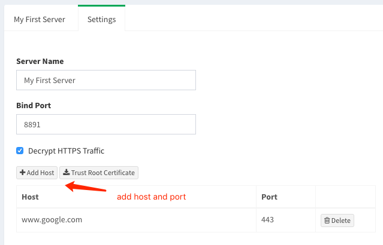

_funnyp_ is a web debugging proxy for developers. You can setup all your proxy servers with differenct group of  proxy rules within single instance.


[](https://npmjs.org/package/funnyp)
[](http://nodejs.org/download/)


**Features**

* Fully configurable for capture and modify http/https requests.
* Multiple proxy servers within single process.
* Web console for inspect requests in real-time.
* Zero-configuration installation.
* Works on any system environment.

## Getting Started

**Install NodeJS**

Download and install nodejs from [https://nodejs.org](https://nodejs.org)

**Install funnyp**

require `sudo` for install as global command

    npm install -g funnyp

**Launch server**

```
funnyp -p 8888
```

Through this command, the web console will be started and listening on the specific port.
You can open the browser and visit `http://(your_ip_address):8888` to check if start successfully.

If there is any proxy server exists, they will also be started.

Notice that funnyp use WebSocket to inspect requests in real time, so you need a browser which supported it.

## Using funnyp

### Server Management

**Create a new server**

You can create a new proxy server by click the `Create Server` button on the dashboard page and input the server name and server port. Notice that the created proxy server should use **different** port with the web console.

After that the new server will be created. Now you can inspect the requests by click `inspect` button. By setting your client (web browser, mobile phone, etc) to using this address and port as http proxy, you will see the incoming requests on the request list table.


**Delete server**

To delete a existing server, you should switch to `setting` tab and click `Delete` button. Be careful, this operation cannot be undo.

### Inspect Requests

You can inpsect each request pass by the proxy server. The following informations are included:

* request url
* request method
* request headers
* request content (available for limited mime-types)
* response status code & status message
* response headers
* response content (available for limited mime-types)


### Proxy Rules

Each proxy server may contains several different type of proxy rules. You can configure your rules according to your needs by swith to `settings` tab and click `Add Rule` button.

Configured rules are orderd and chained. One request can match **at most** one rule. If there is a rule matched for request, then the matching process will break immediatly.

#### Direct Rule

`Direct rule` is the simplest proxy rule. It just pass requests to their requested resource directly without any modification. It is also the default behavior when there is no rules matched for request.

To create a `direct rule`, you simply click `Add Rule` button and select the `direct` option, then type the `regex` as expect url to match. 

The `regex` could be any valid regular expression. 

Here are some examples:

`http://foo.bar/(.*)` as regex: 

It will match all request sent to foo.bar over `http` protocol

`(http|https)://foo.bar/(.*)` as regex: 

It will match all request sent to foo.bar over `http` or `https` protocol

`http://foo.bar/items/(.*)` as regex:

It will match all request sent to foo.bar which path start with `/items`

#### Redirect Rule

`Redirect rule` is used to redirect requests to specified locations.

To create a redirect rule, yo click `Add Rule` button and select the `redirect` option, then type the `regex` as expect url to match and the `Redirect location` as the url to redirect to.

The `regexp` could be any valid regular expression as discussed above.

The `Redirect location` could be any valid url location or an valid replacement string for regex. 

Here are some examples:

`http://foo.bar` as regex and `http://foo.bar/index.html` as location: 

It will match all requests sent to foo.bar and send a redirect response to the client with location http://foo.bar/index.html

`http://foo.net/(.*)` as regex and `http://foo.com/$1` as location: 

It will match all requests sent to foo.bar with any path and send a redirect response to the client with the replaced location.For example, `http://foo.net/items` will redirect to `http://foo.com/items` and `http://foo.net/product?id=123` will redirect to `http://foo.com/product?id=123`, etc.

#### Reverse Proxy Rule

`Reverse proxy rule` is a powerful tool for development. It handle requests and pass requests to the upstream server. The process of request forwarding is transparent for client. This allows you to easily export your own http services as a specific domain name. For example, make all request to `www.google.com` point to your own server and port.

To create a reverse proxy rule, yo click `Add Rule` button and select the `reverse proxy` option, then type the `regex` as expect url to match and the `upstream` as the url to request to the upstream server.

Here are some examples:

`http://foo.bar` as regex and `http://foo.bar/index.html` as upstream: 

It will match all requests sent to foo.bar. Then the proxy server will make a new request which headers are equals to the incoming request and pipe the request  body to the upstream server with url `http://foo.bar/index.html`.  When the proxy server receive the response from upstream server, it then write this response headers and body to the client.

`http://foo.bar/(.*)` as regex and `http://192.168.1.1:8080/$1` as upstream: 

It will match all requests sent to `foo.bar`. Then the proxy server will make a new request which headers are equals to the incoming request and pipe the request body to the upstream server with replaced url. For example, `http://foo.bar/items` will be replaced to `http://192.168.1.1:8080/items` and `http://foo.bar/product?id=123` will be replaced to `http://192.168.1.1:8080/product?id=123`, etc. When the proxy server receive the response from upstream server, it then write this response headers and body to the client.

### Decrypt HTTPS Traffic

By default, funnyp does not capture HTTPs traffic. It simply handle the `CONNECT` request and setup the tunnel between client and request server.

Since the HTTPs requests are encrypted, to capture those requests, you need to trust the `Root Certificate` of funnyp. Download the `crt` file and install this file on your device.


After trust the certificate, you can add the host which you want to decrypt requests on:



Then you will see the requests in the inspector and all features for http server like `redirect` and `reverse proxy` are available now for this host.

## Coming Soon

* Inspect WebSocket messages.
* More configurable and flexible rules.
* Map response content as local file.
* Download captured request / response as file.

